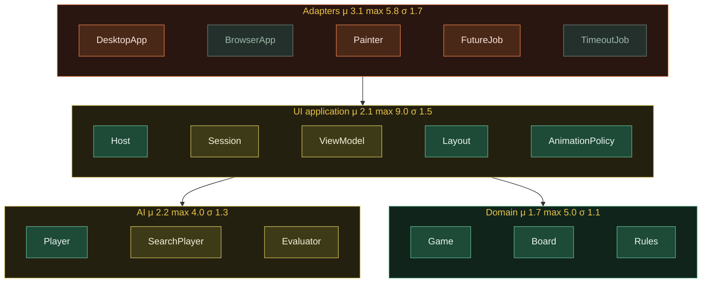

# Othello

Player vs computer Othello in Clojure, ClojureScript, and [Quil](http://quil.info).

You are Black by default. Click a highlighted square. The computer answers with
negamax, alpha-beta pruning, and timed iterative deepening.

## Run on the desktop

Needs Clojure CLI and Java 21+.

```bash
clj -M:run
```

Desktop search budget is about 1.2s per move, with exact search at 12 empties.

## Play in the browser

```bash
clj -M:web watch app
```

Then open [http://localhost:8080/index.html](http://localhost:8080/index.html).
The browser build uses the same rules and UI logic; the computer thinks a bit
less deeply so the page stays responsive.

## Play

- Click a dotted square to move.
- Hover shows a ghost disc.
- The computer thinks, then flips with the same animation you do.

| Key | Action |
|-----|--------|
| `N` | New game |
| `U` | Undo last turn (you + computer) |
| `H` | Toggle move hints |
| `1` | Play Black (you move first) |
| `2` | Play White (computer opens) |

Sidebar buttons do the same things.

## Tests

```bash
clj -M:spec      # Speclj (JVM, against the shared .cljc sources)
clj -M:crap      # CRAP report (coverage + complexity)
clj -M:mutate src/othello/game.cljc --max-workers 3
```

Mutation testing is one file at a time via [clj-mutate](https://github.com/unclebob/clj-mutate).

## Layout

```
src/othello/
  board.cljc         64-square board
  rules.cljc         flips, legal moves, winner
  game.cljc          turn, pass, undo, game over
  ai.cljc            computer entry point
  ai/eval.cljc       positional + mobility evaluation
  ai/search.cljc     negamax / alpha-beta / iterative deepening
  ui/layout.cljc     geometry and hit testing
  ui/anim.cljc       flip/think/pass frame policy
  ui/view.cljc       view-model (no Quil)
  ui/events.cljc     clicks, keys, animation, computer-turn protocol
  ui/host.cljc       shared fun-mode loop and input
  ui/draw.cljc       Quil painting (JVM Processing or browser p5)
  ui/sketch.clj      desktop window and async AI
  ui/web.cljs        browser sketch
  core.clj           desktop -main
```

The domain does not depend on Quil. Only `draw`, `sketch`, and `web` talk to
Processing/p5. `spec/othello/architecture_spec.clj` enforces that.

## Object model

Namespaces map to classes; the UI session is the one object with identity.
Color is mean function CRAP (`clj -M:crap`); labels are μ / max / σ.
Class diagrams and a turn sequence live in [`public/uml.html`](public/uml.html).


